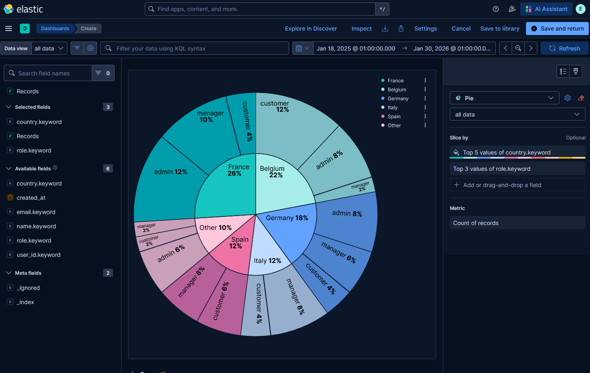

# Elasticsearch Docker Cluster

This project provides a simple Elasticsearch cluster running with Docker Compose.
It allows developers to quickly start a multi-node Elasticsearch environment for testing, development, and learning purposes.

---

# Project Overview

This repository demonstrates how to deploy an Elasticsearch cluster using Docker.

The project includes:

* Elasticsearch nodes running in Docker containers
* Kibana for visualization
* Docker Compose for orchestration
* Scripts to manage the cluster lifecycle
* Example data loading

---

# Security

The cluster uses Elasticsearch’s native security features (X-Pack):

* **Authentication (RBAC)**: Access to the cluster is password-protected. Credentials are managed through environment variables defined in the `.env` file.
* **Transport Layer (Inter-node)**: TLS encryption is enabled for internal communication between nodes (`es01`, `es02`, `es03`), ensuring cluster integrity.
* **HTTP Layer (REST API)**: To simplify local development and data ingestion, the REST AThe cluster uses Elasticsearch’s native security features (X-Pack):

* **Authentication (RBAC)**: Access to the cluster is password-protected. Credentials are managed through environment variables defined in the `.env` file.
* **Transport Layer (Inter-node)**: TLS encryption is enabled for internal communication between nodes (`es01`, `es02`, `es03`), ensuring cluster integrity.
* **HTTP Layer (REST API)**: To simplify local development and data ingestion, the REST API is accessible via **HTTP**.  
  *Note: In production, TLS should also be enabled for the HTTP layer (`xpack.security.http.ssl.enabled: true`).*

```
.env
```

A template is provided:

```
.env.example
```

# Architecture

Example cluster architecture:

Elasticsearch Cluster

* es01 (master node)
* es02 (master node)
* es03 (master node)

All nodes communicate through an internal Docker network.

---

# Prerequisites

Before running this project, make sure you have installed:

* Docker
* Docker Compose
* Terminal / Command Line  (required to execute the project scripts and Docker commands.)

###Check installation

Open a terminal and run:

```
docker --version
docker compose version
```

---

# Project Structure

```
elasticsearch-docker-cluster
|
|-- docker-compose.yml
|-- README.md
|-- .env.example
|-- .gitignore
|
|-- screenshots
|    |--dashboard.png
|
|-- scripts
|   |-- start-cluster.sh
|   |-- stop-cluster.sh
|   |-- check-cluster.sh
|   |-- reset.sh
|   |-- load-sample-data.sh
|   |-- create-indexes.sh
|   
|-- config
|
|-- mappings/
|   |-- users.json
|   |-- products.json
|   |-- orders.json
|   |-- app-logs.json
|   |-- security-logs.json
|
|-- data/
    |-- users.ndjson
    |-- products.ndjson
    |-- orders.ndjson
    |-- app-logs.ndjson
    |-- security-logs.ndjson


```

---

# Setup

Clone the repository:

```
git clone https://github.com/YOUR_USERNAME/elasticsearch-docker-cluster.git
cd elasticsearch-docker-cluster
```

Create your environment configuration file:

```
cp .env.example .env
```

Edit the configuration:

```
nano .env
```

Example configuration:

```
CLUSTER_NAME=es-docker-cluster
ES_PORT=9200
KIBANA_PORT=5601
ELASTIC_PASSWORD=your_password
STACK_VERSION=8.12.2
```

---

# Start the Cluster

Start Elasticsearch and Kibana:

```
./scripts/start.sh
```

You can also start it manually:

```
docker compose up -d
```

---
# Check Cluster Status

Run:

```
./scripts/check-cluster.sh
```

This will display:

* cluster health
* active nodes

---

# Initialize Indices

Run:

´´´
./scripts/create_indices.sh
´´´
This will ensure your "armoire" (the index) is perfectly built and labeled before you begin injecting your data.

---

# Load Sample Data

To populate your indices with initial data, run the following command. 
It uses the Elasticsearch **_bulk API** to efficiently load all files from the `/data` folder:

```
./scripts/load-sample-data.sh
```

The ingestion script:

* Loads all `.ndjson` files from the `data/` directory.
* Sends the documents to Elasticsearch using the **Bulk API** (`POST /_bulk`).
* Displays the number of **successfully indexed documents**.

---

# Stop the Cluster

```
./scripts/stop.sh
```

This stops the containers but keeps the data volumes.

---

# Reset the Cluster

To completely reset the environment, remove all data and recreate fresh indices with their mappings in one command:

```
./scripts/reset.sh
```

This command removes:

* containers
* networks
* volumes
* all Elasticsearch data
* Deletes existing indices to ensure no data pollution.
* Recreates all indices

---

# Access Kibana

Open your browser:

```
http://localhost:5601
```
Login with:

```
username: elastic
password: YOUR_PASSWORD
```

### Check if Kibana is ready

You can verify that Kibana is running with:

```bash
docker ps kibana
```
or open in your browser:

```
http://localhost:5601/status
```
---

## Data Format

The data format used in this project is NDJSON (Newline Delimited JSON) compatible with the Elasticsearch Bulk API.

Each document is indexed with the following structure:

{ "index": { "_index": "index-name" } }
{ document }
Indices and Fields


### 1. Users Index (users)
Bietet eine Übersicht der registrierten Benutzer und deren Rollen.

| Feld | Typ | Beschreibung |
| :--- | :--- | :--- |
| `user_id` | keyword | Eindeutige Kennung des Benutzers |
| `name` | text | Vollständiger Name (durchsuchbar) |
| `email` | keyword | E-Mail-Adresse für Logins |
| `role` | keyword | Benutzerrolle (admin, customer, etc.) |
| `country` | keyword | Herkunftsland |
| `created_at` | date | Registrierungsdatum |
Contains information about users.

---

##### Example document:

```json
{
  "user_id": "u1001",
  "name": "User 1",
  "email": "user1@example.com",
  "role": "customer",
  "country": "France",
  "created_at": "2025-02-10T10:00:00Z"
}
```

### 2.Products Index (products)

Contains product catalog information.


### 3. Orders Index (orders)

Contains purchase orders.

### 4. Application Logs (app-logs)

Simulated logs generated by different services.

### 5. Security Logs (security-logs)

Logs related to user authentication and security events.


### Data Volume

The dataset includes:

50 users

100 products

300 orders

200 security events

200 application logs

Total: 850+ indexed documents

---
## Data Exploration in Kibana

Once Kibana is running, you can explore the indexed data using the **Discover** tool.


1. **Open Discover**

In the main menu (≡) at the top left, navigate to:

```
Analytics → Discove
```

2. **Select the Data View**

In the left panel, select the data view corresponding to your index (for example `users*`).

3. **Explore the Data**

- The **histogram at the top** shows the distribution of documents over time.
- The **table below** displays the indexed documents in JSON format.

### Useful Tips

- **Search and filter data**

Use the search bar  to filter documents. Example:

```
country = Germany
```
result 9 JSON doc

# Kibana Dashboard Overview



*Example visualization showing the geographic distribution and roles of indexed users.*

The dashboard uses **Kibana Lens** to display:

- Distribution of users by **country**
- Distribution by **role** (admin, manager, customer)
- Aggregated statistics based on indexed documents

---
# Useful Elasticsearch Commands

You can test Elasticsearch manually using the following commands.

**Important:** Replace `YOUR_PASSWORD` with the password defined in your `.env` file.

Cluster health:
```
curl -u elastic:YOUR_PASSWORD http://localhost:9200/_cluster/health?pretty
```
List nodes:
```
curl -u elastic:YOUR_PASSWORD http://localhost:9200/_cat/nodes?v
```
List indices:
```
curl -u elastic:YOUR_PASSWORD http://localhost:9200/_cat/indices?v 
```

---

# Learning Goals

This project demonstrates:

* Elasticsearch cluster deployment
* Docker container orchestration
* Environment configuration with `.env`
* Basic DevOps scripting
* Elasticsearch API usage
* visualization of data

---
